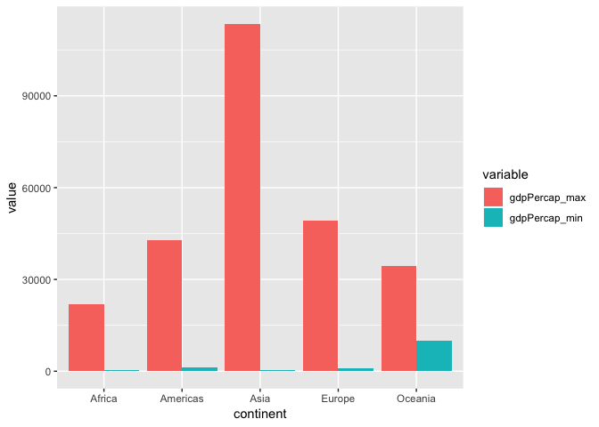
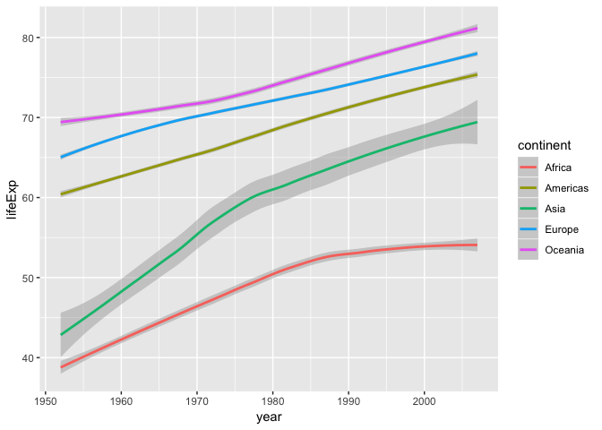
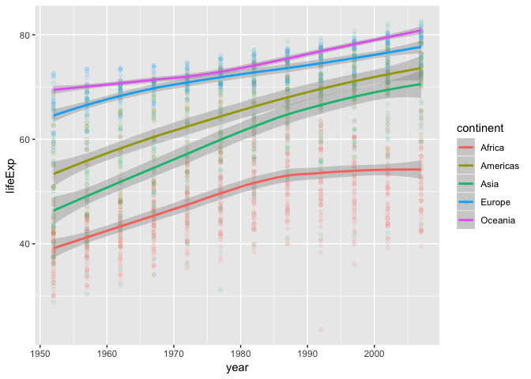
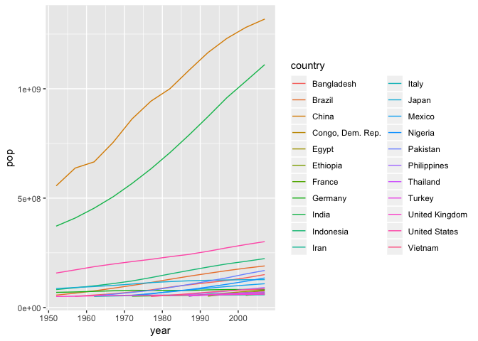
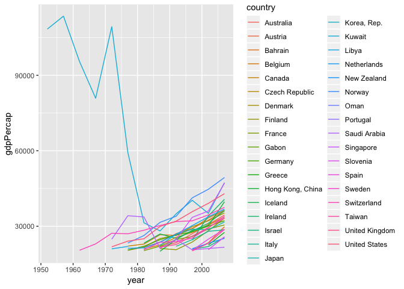
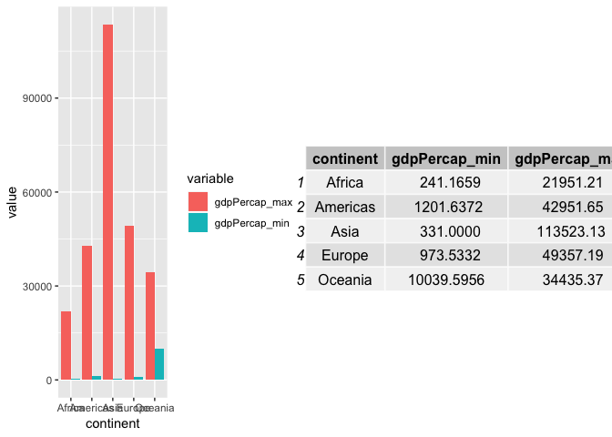

hw03-gapminder
================

Including packages:
-------------------

``` r
library(gapminder)
library(tidyverse)
```

    ## ── Attaching packages ────────────────────────────────── tidyverse 1.2.1 ──

    ## ✔ ggplot2 3.0.0     ✔ purrr   0.2.5
    ## ✔ tibble  1.4.2     ✔ dplyr   0.7.6
    ## ✔ tidyr   0.8.1     ✔ stringr 1.3.1
    ## ✔ readr   1.1.1     ✔ forcats 0.3.0

    ## ── Conflicts ───────────────────────────────────── tidyverse_conflicts() ──
    ## ✖ dplyr::filter() masks stats::filter()
    ## ✖ dplyr::lag()    masks stats::lag()

Get the maximum and minimum of GDP per capita for all continents:
-----------------------------------------------------------------

``` r
gdpByCont <- gapminder %>% 
  group_by(continent) %>% 
  summarize(gdpPercap_min = min(gdpPercap), gdpPercap_max = max(gdpPercap))
gdpByCont
```

    ## # A tibble: 5 x 3
    ##   continent gdpPercap_min gdpPercap_max
    ##   <fct>             <dbl>         <dbl>
    ## 1 Africa             241.        21951.
    ## 2 Americas          1202.        42952.
    ## 3 Asia               331        113523.
    ## 4 Europe             974.        49357.
    ## 5 Oceania          10040.        34435.

And then make a box plot to show the data above:

``` r
gdpByCont %>% 
  # gather the max and min data in one "value"
  gather(variable,value,-continent) %>% 
  ggplot(aes(x=continent, y=value, fill = variable)) + 
  # make the max and min value adopt "dodge" positions in one bar plot
  geom_col(position = position_dodge())
```



Compute a trimmed mean of life expectancy for different years. Or a weighted mean, weighting by population.
-----------------------------------------------------------------------------------------------------------

I computed the wieghted mean with the weighted.mean() function:

``` r
wtMean <- gapminder %>% 
  group_by(continent,year) %>% 
  summarise(lifeExp=weighted.mean(lifeExp,pop))
wtMean
```

    ## # A tibble: 60 x 3
    ## # Groups:   continent [?]
    ##    continent  year lifeExp
    ##    <fct>     <int>   <dbl>
    ##  1 Africa     1952    38.8
    ##  2 Africa     1957    40.9
    ##  3 Africa     1962    43.1
    ##  4 Africa     1967    45.2
    ##  5 Africa     1972    47.2
    ##  6 Africa     1977    49.2
    ##  7 Africa     1982    51.0
    ##  8 Africa     1987    52.8
    ##  9 Africa     1992    53.4
    ## 10 Africa     1997    53.3
    ## # ... with 50 more rows

Then I tend to plot the results above in chronical order, and make the line smooth, coloured with continent:

``` r
ggplot(wtMean, aes(year,lifeExp)) +
  geom_smooth(method = 'loess',aes(colour=continent))
```



How is life expectancy changing over time on different continents?
------------------------------------------------------------------

First make a table to show the lifeExp values:

``` r
gapminder %>% 
  group_by(continent,year) %>% 
  summarise(lifeExp=mean(lifeExp))
```

    ## # A tibble: 60 x 3
    ## # Groups:   continent [?]
    ##    continent  year lifeExp
    ##    <fct>     <int>   <dbl>
    ##  1 Africa     1952    39.1
    ##  2 Africa     1957    41.3
    ##  3 Africa     1962    43.3
    ##  4 Africa     1967    45.3
    ##  5 Africa     1972    47.5
    ##  6 Africa     1977    49.6
    ##  7 Africa     1982    51.6
    ##  8 Africa     1987    53.3
    ##  9 Africa     1992    53.6
    ## 10 Africa     1997    53.6
    ## # ... with 50 more rows

This time, I plot both the points and the smoothed line to show the lifeExp change in one graph:

``` r
ggplot(gapminder, aes(year,lifeExp)) +
  geom_point(aes(colour=continent),alpha=0.1) +
  geom_smooth(method = 'loess',aes(colour=continent))
```

 I've noticed that the lifeExp in Oceania tends to grow faster over time. In Enrope and America, the lifeExp grows smoothly. While in Asia and Africa, the growing speed become slower over time.

Find countries with interesting stories. Open-ended and, therefore, hard. Promising but unsuccessful attempts are encouraged.
-----------------------------------------------------------------------------------------------------------------------------

Let's first focus on the country with population larger than 50 millions, with a table with mean population of the filtered countries:

``` r
popMean <- gapminder %>% 
  group_by(country,year,continent) %>% 
  filter(pop > 50000000) %>%  
  summarise(pop=mean(pop))
popMean
```

    ## # A tibble: 190 x 4
    ## # Groups:   country, year [?]
    ##    country     year continent       pop
    ##    <fct>      <int> <fct>         <dbl>
    ##  1 Bangladesh  1957 Asia       51365468
    ##  2 Bangladesh  1962 Asia       56839289
    ##  3 Bangladesh  1967 Asia       62821884
    ##  4 Bangladesh  1972 Asia       70759295
    ##  5 Bangladesh  1977 Asia       80428306
    ##  6 Bangladesh  1982 Asia       93074406
    ##  7 Bangladesh  1987 Asia      103764241
    ##  8 Bangladesh  1992 Asia      113704579
    ##  9 Bangladesh  1997 Asia      123315288
    ## 10 Bangladesh  2002 Asia      135656790
    ## # ... with 180 more rows

NOw making a plot of the popolation growth in different countries:

``` r
ggplot(subset(popMean),
       aes(x = year, y = pop, group = country, color = country))+
       geom_line()
```



The graph shows two specific countries with a high population growing speed: China and India.

Then I'm trying to do something with the 'gdpPercap' variable. First make a table to show the values with gdpPercap larger than 20000:

``` r
Mean <- gapminder %>%
  group_by(country,year,continent) %>%
  filter(gdpPercap > 20000) %>%
  summarise(gdpPercap=gdpPercap)
Mean
```

    ## # A tibble: 164 x 4
    ## # Groups:   country, year [?]
    ##    country    year continent gdpPercap
    ##    <fct>     <int> <fct>         <dbl>
    ##  1 Australia  1987 Oceania      21889.
    ##  2 Australia  1992 Oceania      23425.
    ##  3 Australia  1997 Oceania      26998.
    ##  4 Australia  2002 Oceania      30688.
    ##  5 Australia  2007 Oceania      34435.
    ##  6 Austria    1982 Europe       21597.
    ##  7 Austria    1987 Europe       23688.
    ##  8 Austria    1992 Europe       27042.
    ##  9 Austria    1997 Europe       29096.
    ## 10 Austria    2002 Europe       32418.
    ## # ... with 154 more rows

I then plot the data with geom\_line:

``` r
ggplot(subset(Mean),
       aes(x = year, y = gdpPercap, group = country, color = country))+
       geom_line()
```



From which I found the gdpPercap in Kuwait was very high at first, how ever it changed dramatically afterwards and went trough a rapidly drop between 1970s and 1980s. I did some searches and found from [Kuwait’s Souk al-Manakh Stock Bubble](http://www.thebubblebubble.com/souk-al-manakh/) that in this period it

> experienced a major economic crisis after the Souk Al-Manakh stock market crash and decrease in oil price.

But I want to do more:
----------------------

I want to get table and figure side-by-side. I found the grid.arrage() function, which is in the 'gridExtra' library to make the layout in a grid view. For this situation, I just need to make the table and plot in 2 different columns. (I reused the max-min 'gdpByCont' table from the first section.)

``` r
library("gridExtra")
```

    ## 
    ## Attaching package: 'gridExtra'

    ## The following object is masked from 'package:dplyr':
    ## 
    ##     combine

``` r
# turn the table into tableGrob
t <-  tableGrob(gdpByCont)
# same operation as before to generate a plot
p <- gdpByCont %>% 
  gather(variable,value,-continent) %>% 
  ggplot(aes(x=continent, y=value, fill = variable)) + 
  geom_col(position = position_dodge())
# arrage them in 2-column grid view
grid.arrange(p, t, ncol=2)
```


