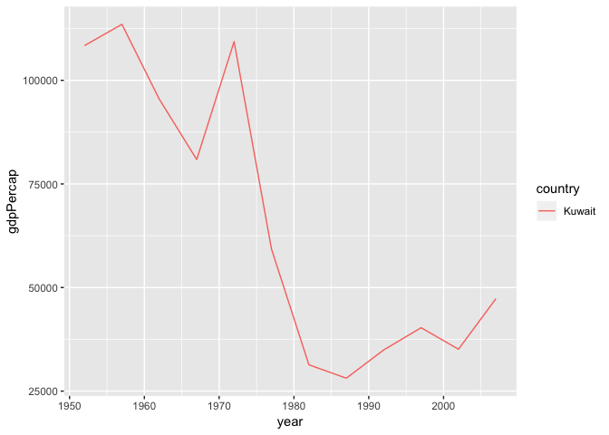

hw03-gapminder
================

Including packages:
-------------------

``` r
library(gapminder)
library(tidyverse)
```

    ## ── Attaching packages ─────────────────────────────────────────────────────────────────── tidyverse 1.2.1 ──

    ## ✔ ggplot2 3.0.0     ✔ purrr   0.2.5
    ## ✔ tibble  1.4.2     ✔ dplyr   0.7.6
    ## ✔ tidyr   0.8.1     ✔ stringr 1.3.1
    ## ✔ readr   1.1.1     ✔ forcats 0.3.0

    ## ── Conflicts ────────────────────────────────────────────────────────────────────── tidyverse_conflicts() ──
    ## ✖ dplyr::filter() masks stats::filter()
    ## ✖ dplyr::lag()    masks stats::lag()

Get the maximum and minimum of GDP per capita for all continents:
-----------------------------------------------------------------

``` r
gdpByCont <- gapminder %>% 
  group_by(continent) %>% 
  summarize(gdpPercap_min = min(gdpPercap), gdpPercap_max = max(gdpPercap))
gdpByCont
```

    ## # A tibble: 5 x 3
    ##   continent gdpPercap_min gdpPercap_max
    ##   <fct>             <dbl>         <dbl>
    ## 1 Africa             241.        21951.
    ## 2 Americas          1202.        42952.
    ## 3 Asia               331        113523.
    ## 4 Europe             974.        49357.
    ## 5 Oceania          10040.        34435.

And then make a box plot to show the data above:

``` r
gdpByCont %>% 
  # gather the max and min data in one "value"
  gather(variable,value,-continent) %>% 
  ggplot(aes(x=continent, y=value, fill = variable)) + 
  # make the max and min value adopt "dodge" positions in one bar plot
  geom_col(position = position_dodge())
```

 \#\# Compute a trimmed mean of life expectancy for different years. Or a weighted mean, weighting by population. Just try something other than the plain vanilla mean.

``` r
wtMean <- gapminder %>% 
  group_by(continent,year) %>% 
  summarise(lifeExp=weighted.mean(lifeExp,pop))
wtMean
```

    ## # A tibble: 60 x 3
    ## # Groups:   continent [?]
    ##    continent  year lifeExp
    ##    <fct>     <int>   <dbl>
    ##  1 Africa     1952    38.8
    ##  2 Africa     1957    40.9
    ##  3 Africa     1962    43.1
    ##  4 Africa     1967    45.2
    ##  5 Africa     1972    47.2
    ##  6 Africa     1977    49.2
    ##  7 Africa     1982    51.0
    ##  8 Africa     1987    52.8
    ##  9 Africa     1992    53.4
    ## 10 Africa     1997    53.3
    ## # ... with 50 more rows

``` r
ggplot(wtMean, aes(year,lifeExp)) +
  geom_smooth(method = 'loess',aes(colour=continent))
```


How is life expectancy changing over time on different continents?
------------------------------------------------------------------

``` r
gapminder %>% 
  group_by(continent,year) %>% 
  summarise(lifeExp=mean(lifeExp))
```

    ## # A tibble: 60 x 3
    ## # Groups:   continent [?]
    ##    continent  year lifeExp
    ##    <fct>     <int>   <dbl>
    ##  1 Africa     1952    39.1
    ##  2 Africa     1957    41.3
    ##  3 Africa     1962    43.3
    ##  4 Africa     1967    45.3
    ##  5 Africa     1972    47.5
    ##  6 Africa     1977    49.6
    ##  7 Africa     1982    51.6
    ##  8 Africa     1987    53.3
    ##  9 Africa     1992    53.6
    ## 10 Africa     1997    53.6
    ## # ... with 50 more rows

``` r
ggplot(gapminder, aes(year,lifeExp)) +
  geom_point(aes(colour=continent),alpha=0.1) +
  geom_smooth(method = 'loess',aes(colour=continent))
```

 \#\# Find countries with interesting stories. Open-ended and, therefore, hard. Promising but unsuccessful attempts are encouraged. This will generate interesting questions to follow up on in class.

``` r
popMean <- gapminder %>% 
  group_by(country,year,continent) %>% 
  filter(pop > 50000000) %>%  
  summarise(pop=mean(pop))
popMean
```

    ## # A tibble: 190 x 4
    ## # Groups:   country, year [?]
    ##    country     year continent       pop
    ##    <fct>      <int> <fct>         <dbl>
    ##  1 Bangladesh  1957 Asia       51365468
    ##  2 Bangladesh  1962 Asia       56839289
    ##  3 Bangladesh  1967 Asia       62821884
    ##  4 Bangladesh  1972 Asia       70759295
    ##  5 Bangladesh  1977 Asia       80428306
    ##  6 Bangladesh  1982 Asia       93074406
    ##  7 Bangladesh  1987 Asia      103764241
    ##  8 Bangladesh  1992 Asia      113704579
    ##  9 Bangladesh  1997 Asia      123315288
    ## 10 Bangladesh  2002 Asia      135656790
    ## # ... with 180 more rows

``` r
ggplot(subset(popMean),
       aes(x = year, y = pop, group = country, color = country))+
       geom_line()
```


``` r
# Mean <- gapminder %>% 
#   group_by(country,year,continent) %>% 
#   filter(gdpPercap > 20000) %>%  
#   summarise(gdpPercap=mean(gdpPercap))
# Mean
# ggplot(subset(Mean),
#        aes(x = year, y = gdpPercap, group = country, color = country))+
#        geom_line()
Mean <- gapminder %>% 
  group_by(country,year) %>% 
  filter(country == "Kuwait") %>%  
  summarise(gdpPercap=mean(gdpPercap))
Mean
```

    ## # A tibble: 12 x 3
    ## # Groups:   country [?]
    ##    country  year gdpPercap
    ##    <fct>   <int>     <dbl>
    ##  1 Kuwait   1952   108382.
    ##  2 Kuwait   1957   113523.
    ##  3 Kuwait   1962    95458.
    ##  4 Kuwait   1967    80895.
    ##  5 Kuwait   1972   109348.
    ##  6 Kuwait   1977    59265.
    ##  7 Kuwait   1982    31354.
    ##  8 Kuwait   1987    28118.
    ##  9 Kuwait   1992    34933.
    ## 10 Kuwait   1997    40301.
    ## 11 Kuwait   2002    35110.
    ## 12 Kuwait   2007    47307.

``` r
ggplot(subset(Mean),
       aes(x = year, y = gdpPercap, group = country, color = country))+
       geom_line()
```


